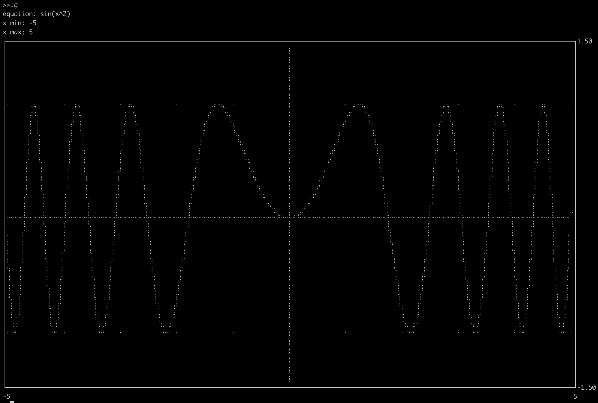

# rm-repl [](https://github.com/ShaneMarusczak/rm-repl/actions/workflows/rust.yml)

A terminal calculator and grapher (`rmr`) built on
[rusty-maths](https://github.com/ShaneMarusczak/rusty-maths).



## Install

```
cargo install --path .
```

Run `rmr` with no arguments for a repl session, or pass an expression to
evaluate one-shot (see [CLI](#cli)).

## The repl

Expressions evaluate on enter. `ans` always holds the last successful
answer. Errors point at the offending input:

```
>>21 + 21
42
>>ans / 6
7
>>2 + sinq(3)
      ^^^^
Invalid function name sinq — did you mean 'sin'?
```

Run `:fns` to list every available function, operator, and constant, or
`:fns <name>` for details on one.

### Bindings

`let` names a value or a single-parameter function. Bindings persist across
sessions (in `~/.rmr_bindings`) and work anywhere an expression does,
including graph and table mode.

```
>>let a = 3
a = 3
>>let g(x) = a * x^2
g(x) = a * x^2
>>g(2) + 1
13
>>4 |> g
48
```

- Value bindings evaluate immediately — `let k = ans` captures the last
  answer as a number.
- Function bodies are saved as written and read other bindings when
  *called*: redefine `a` above and `g` changes with it. The parameter is
  always `x`.
- `ans` is itself a binding, updated after every successful evaluation. It
  can't be redefined, and function bodies can't capture it — bind it to a
  name first.

### Commands

```
:g  | :graph              graph one or more equations
:t  | :table              table of points for an equation
:o  | :graph options      set graph width
:ag | :animated graph     graph that zooms out over time
:ig | :interactive graph  graph that pans with the arrow keys (q to quit)
:sg | :scrollable graph   cursor walks the curve with a live x/y readout
                          (←/→ move, ↑/↓ switch equations, q to quit)
:la | :linear algebra     vector ops (vs = sum, vm = mean, b = back)
:c  | :cube | :3d         animated cube
:qbc / :cbc               quadratic / cubic bezier curves
:p  | :precision <n>      set decimal display precision
:fns [name]               list functions/operators/constants and your bindings
:undef <name>             remove a let binding
:clear                    clear the screen
:h  | :help               help
:q  | :quit               exit
```

Graph mode accepts multiple equations separated by `|`, plotted in a shared
graph space:

```
>>:g
equation:y=sin(x) | y=cos(x)
```

## CLI

Passing arguments evaluates without entering the repl (saved bindings are
not loaded in one-shot mode):

```
rmr 84/2                  evaluate an expression
rmr -g y=x -5 5           graph: equation, x-min, x-max
rmr -t y=x -5 5 1         table: equation, x-min, x-max, step size
```

Note: shells interpret `(` and `)` — quote any expression that uses them:
`rmr "sqrt(1764)"`.
